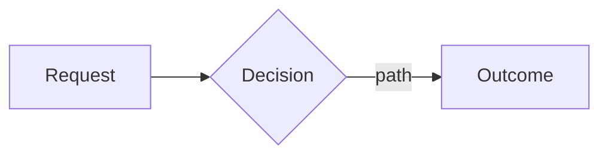

# Four-pack — authoring method and templates

## Contents

- [1. proposal.md — establishes WHY](#1-proposalmd--establishes-why)
- [2. specs/<capability>.md — defines WHAT (delta spec)](#2-specscapabilitymd--defines-what-delta-spec)
- [3. design.md — explains HOW](#3-designmd--explains-how)
- [4. tasks.md — the implementation checklist](#4-tasksmd--the-implementation-checklist)

Aligned with OpenSpec v1.13.2 (`db230978`), `schemas/spec-driven/{schema.yaml,templates/}`, adapted for
the vault: artifacts live in `01 Work/projects/<PROJECT>/SDD/<ticket>-<slug>/`,
frontmatter carries the two tiers, content is written in **English** (native, to
match OpenSpec and avoid translation drift).

> The `instruction` text below is a **constraint for the author (you)**, not
> content to copy into the file. Fill the template's sections; never paste these
> guidance blocks into the artifact.

Drafting order (use planning-contract.md for completeness and skip_specs):

```
proposal.md  →  specs/<capability>.md  →  design.md  →  tasks.md
```

Fill `<...>` placeholders. Use today's date (from the session environment) for
`created:`. `<ticket>` e.g. `PROJ-101`; `<title>` the ticket's one-line title.

---

## 1. proposal.md — establishes WHY

**Instruction**

Sections:

- **Why**: 1–2 sentences on the problem or opportunity. What problem does this solve? Why now?
- **What Changes**: Bullet list of concrete changes (new capabilities, modifications, removals). Mark breaking changes with **BREAKING**.
- **Capabilities**: the contract between proposal and specs. Read canonical project `specs/` first; historical `SDD/*/specs/*.md` are deltas, not current truth. If no baseline exists, establish it from merged changes and pre-change code/tests, recording gaps. Reuse exact capability names/paths. Read `planning-contract.md` for explicit no-behavior-change opt-out.
  - **New Capabilities**: each becomes a new `specs/<name>.md` (kebab-case, e.g. `rate-limit`).
  - **Modified Capabilities**: existing capabilities whose _requirements_ change (not mere implementation detail). Each needs a delta spec. Leave empty if none.
- **Impact**: affected code, APIs, dependencies, systems; backward-compatibility note.

Keep it concise (1–2 pages). Focus on the "why", not the "how" — implementation
detail belongs in design.md. This is the foundation the other three build on.

Set `propose_tier` here (whole-ticket difficulty → CI depth). `design_approved`
is always `false` at propose time (a human flips it before apply).

**Template**

```markdown
---
ticket: <ticket>
title: <title>
type: proposal
project: <PROJECT>
jira: "<jira-url-or-TBD>"
propose_tier: <lint|unit|integration|e2e|e2e-live>
status: proposed
design_approved: false
created: <YYYY-MM-DD>
---

## Why

<1–2 sentences: the problem and why now.>

## What Changes

- <specific change>
- <specific change; mark **BREAKING** if applicable>

## Capabilities

### New Capabilities

- `<capability-kebab>`: <one line>. See `specs/<capability-kebab>.md`.

### Modified Capabilities

<!-- None. -->  <!-- or: `<capability>`: <what requirement changes> -->

## Impact

- **Affected code**: <modules / middleware / layer>
- **Dependencies**: <new or changed deps, or "none">
- **Risk**: <the main way this goes wrong>
- **Backward compatibility**: <impact on existing clients>
```

---

## 2. specs/<capability>.md — defines WHAT (delta spec)

**Instruction**

A spec is a **behavior contract, not an implementation plan**.

Belongs in a spec:

- Observable behavior that users or downstream systems rely on.
- Inputs, outputs, and error conditions.
- External constraints (security, privacy, reliability, compatibility).
- Scenarios that can be tested or explicitly validated.

Does not belong in a spec:

- Internal class / function names.
- Library or framework choices.
- Step-by-step implementation detail.
- Execution plans — those belong in design.md or tasks.md.

Quick test: if the implementation can change without changing externally visible
behavior, it does not belong in the spec.

One spec file per capability from the proposal's Capabilities section.

- New capability: use the exact kebab-case name → `specs/<capability>.md`.
- Modified capability: match the existing spec's folder/name.

Delta operations (H2 headers, plural):

- **`## ADDED Requirements`** — new capabilities
- **`## MODIFIED Requirements`** — changed behavior; **MUST include the full updated requirement block**, not just the diff
- **`## REMOVED Requirements`** — deprecated; **MUST include `**Reason**` and `**Migration**`**
- **`## RENAMED Requirements`** — name only; use `FROM:` / `TO:`

Format rules:

- Each requirement: `### Requirement: <name>` + description using **SHALL/MUST** (avoid should/may).
- Each scenario: `#### Scenario: <name>` in **WHEN/THEN** form.
- **CRITICAL**: scenarios use **exactly 4 hashtags** (`####`). 3 hashtags or bullets fail silently.
- Every ADDED/MODIFIED requirement has **at least one** nonempty WHEN/THEN scenario. REMOVED uses Reason/Migration; RENAMED uses FROM/TO and retained baseline behavior, not invented scenarios.

**New capability only**: open the delta spec with a `## Purpose` section — one or
two sentences (50+ characters) on what the capability is for. A delta for an
**existing** capability gets no `## Purpose`; that capability already has one.

MODIFIED workflow: locate the existing requirement, copy the ENTIRE block, paste
under `## MODIFIED Requirements`, edit to new behavior, keep header text matching.
If you're adding a new concern without changing existing behavior → use ADDED,
not MODIFIED. Specs must be testable: each scenario is a potential test case
(these are the acceptance criteria M5 review re-checks).

**Template**

```markdown
---
ticket: <ticket>
capability: <capability-kebab>
type: spec-delta
created: <YYYY-MM-DD>
---

## Purpose

<New capability only: one or two sentences (50+ chars) on what this capability is for. Delete this section for an existing capability.>

## ADDED Requirements

### Requirement: <name>

The <system> SHALL <normative behavior>.

#### Scenario: <name>

- **WHEN** <condition>
- **THEN** <observable outcome>

#### Scenario: <another>

- **WHEN** <condition>
- **THEN** <outcome>

<!-- If modifying existing behavior instead: -->

## MODIFIED Requirements

### Requirement: <existing name, verbatim>

<full updated requirement block, including all scenarios>

<!-- If removing: -->

## REMOVED Requirements

### Requirement: <name>

**Reason**: <why>
**Migration**: <what to use instead>
```

---

## 3. design.md — explains HOW

**Instruction**

Create design.md when any apply: cross-cutting change; new architectural pattern;
new external dependency or significant data-model change; security/performance/
migration complexity; ambiguity best resolved before coding. (For a truly trivial
change you may keep it minimal, but the linear chain still expects the file.)

Sections:

- **Context**: only the current state and constraints needed to explain the approach. Point at the proposal for motivation (e.g. "See proposal.md — Why"); don't restate it.
- **Goals / Non-Goals**: what this achieves and what it explicitly excludes. Add design-level boundaries only; don't restate the proposal's scope.
- **Decisions**: key technical choices **with rationale and alternatives** (why X over Y?). This is where N approaches + trade-offs live.
- **Risks / Trade-offs**: known limits, failure modes. Format: `[Risk] → Mitigation`.
- **Migration Plan** (if applicable): deploy steps, rollback.
- **Open Questions**: unknowns that can safely be answered later **without** changing the specs, the approach, or the task breakdown. Omit the section if there are none.

Open Questions are for genuinely deferrable unknowns, not for decisions you
skipped. If a question would change the specs, the chosen approach, or the task
breakdown → resolve it now. Ask the user; don't guess.

Focus on architecture and approach, not line-by-line code. The proposal covers
why and what; design covers how. Reference the proposal for motivation and the
specs for requirements — if a section would only restate them, point at them
instead. A non-trivial flow gets a mermaid diagram (when a node links to a note,
add `class NodeName internal-link;`).

**Template**

````markdown
---
ticket: <ticket>
title: <title>
type: design
created: <YYYY-MM-DD>
---

## Context

<current state and constraints that shape the approach. See proposal.md — Why for motivation; don't restate it.>

## Goals / Non-Goals

**Goals:**

- <goal>

**Non-Goals:**

- <explicit exclusion>

## Decisions

- **<decision>**: <choice> — <why this over the alternative(s)>.


````

## Risks / Trade-offs

- **<risk>**: <description> → <mitigation>.

````

---

## 4. tasks.md — the implementation checklist

**Instruction**

Before writing tasks, check `design.md` for **Open Questions**. If any of them
would change what gets built, resolve it with the user first. Never bake an
unstated assumption into the task list.

**Follow the format exactly** — the apply phase (M4) parses `- [ ]` checkboxes to
track progress, and `validate_sdd.py` requires a task tier on every task. Generate canonical `- [ ]` tasks with a `[tier]` tag. Reading uses the shared parser: only x/X (allowing surrounding spaces) is done; empty/unknown one-character markers stay pending. `validate_sdd.py --tasks-json` is the authority, including nested and alternate CommonMark list markers.

Guidelines:
- Group related tasks under `## N` numbered headings.
- Each task: `- [ ] N.M \`[tier]\` <description>` where tier ∈ `sonnet|opus` (never `haiku`).
- **One behavior task = one complete TDD cycle** (RED → GREEN → applicable checks). Do not split RED and GREEN into tasks that each must finish green. Non-behavior tasks use their stated verification command or delivered artifact.
- Each checkbox MUST name its verification: test, command, observable outcome, or delivered artifact.
- Each group lands its own required tests and documentation; a final group is only for cross-group integration. Do not invent docs/tests for work that needs neither.
- Put `Depends on: none` or `Depends on: 1, 2` immediately under each group heading. Missing declarations on old plans mean serial group order, not independence. Reject unknown dependencies/cycles before apply. Overlapping file ownership also requires serialization.
- Keep each task small enough for one session; order by dependency.

Reference specs for *what* to build, design for *how*.

**Template**

```markdown
---
ticket: <ticket>
title: <title>
type: tasks
created: <YYYY-MM-DD>
---

## 1. <group>

Depends on: none

- [ ] 1.1 `[opus]` Implement <behavior> with RED→GREEN; verify <named test command> passes.
- [ ] 1.2 `[sonnet]` Document <changed interface>; verify <documented example> works.

## 2. <dependent group>

Depends on: 1

- [ ] 2.1 `[opus]` Implement <dependent behavior> with RED→GREEN; verify <integration command> passes.
````
