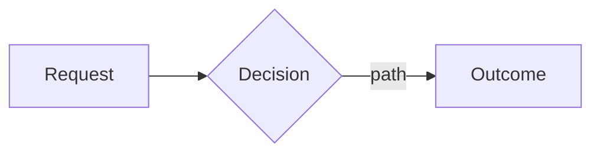

# Four-pack — authoring method and templates

## Contents

- [1. proposal.md — establishes WHY](#1-proposalmd--establishes-why)
- [2. specs/<capability>.md — defines WHAT (delta spec)](#2-specscapabilitymd--defines-what-delta-spec)
- [3. design.md — explains HOW](#3-designmd--explains-how)
- [4. tasks.md — the implementation checklist](#4-tasksmd--the-implementation-checklist)

Ported from OpenSpec `schemas/spec-driven/{schema.yaml,templates/}`, adapted for
the vault: artifacts live in `01 Work/projects/<PROJECT>/SDD/<ticket>-<slug>/`,
frontmatter carries the two tiers, content is written in **English** (native, to
match OpenSpec and avoid translation drift).

> The `instruction` text below is a **constraint for the author (you)**, not
> content to copy into the file. Fill the template's sections; never paste these
> guidance blocks into the artifact.

Dependency chain (first missing file = next step):

```
proposal.md  →  specs/<capability>.md  →  design.md  →  tasks.md
```

Fill `<...>` placeholders. Use today's date (from the session environment) for
`created:`. `<ticket>` e.g. `PROJ-101`; `<title>` the ticket's one-line title.

---

## 1. proposal.md — establishes WHY

**Instruction**

Sections:

- **Why**: 1–2 sentences on the problem or opportunity. What problem does this solve? Why now?
- **What Changes**: Bullet list of concrete changes (new capabilities, modifications, removals). Mark breaking changes with **BREAKING**.
- **Capabilities**: the contract between proposal and specs — research existing specs first.
  - **New Capabilities**: each becomes a new `specs/<name>/spec.md` (kebab-case, e.g. `rate-limit`).
  - **Modified Capabilities**: existing capabilities whose _requirements_ change (not mere implementation detail). Each needs a delta spec. Leave empty if none.
- **Impact**: affected code, APIs, dependencies, systems; backward-compatibility note.

Keep it concise (1–2 pages). Focus on the "why", not the "how" — implementation
detail belongs in design.md. This is the foundation the other three build on.

Set `propose_tier` here (whole-ticket difficulty → CI depth). `design_approved`
is always `false` at propose time (a human flips it before apply).

**Template**

```markdown
---
ticket: <ticket>
title: <title>
type: proposal
project: <PROJECT>
jira: "<jira-url-or-TBD>"
propose_tier: <lint|unit|integration|e2e|e2e-live>
status: proposed
design_approved: false
created: <YYYY-MM-DD>
---

## Why

<1–2 sentences: the problem and why now.>

## What Changes

- <specific change>
- <specific change; mark **BREAKING** if applicable>

## Capabilities

### New Capabilities

- `<capability-kebab>`: <one line>. See `specs/<capability-kebab>.md`.

### Modified Capabilities

<!-- None. -->  <!-- or: `<capability>`: <what requirement changes> -->

## Impact

- **Affected code**: <modules / middleware / layer>
- **Dependencies**: <new or changed deps, or "none">
- **Risk**: <the main way this goes wrong>
- **Backward compatibility**: <impact on existing clients>
```

---

## 2. specs/<capability>.md — defines WHAT (delta spec)

**Instruction**

One spec file per capability from the proposal's Capabilities section.

- New capability: use the exact kebab-case name → `specs/<capability>.md`.
- Modified capability: match the existing spec's folder/name.

Delta operations (H2 headers, plural):

- **`## ADDED Requirements`** — new capabilities
- **`## MODIFIED Requirements`** — changed behavior; **MUST include the full updated requirement block**, not just the diff
- **`## REMOVED Requirements`** — deprecated; **MUST include `**Reason**` and `**Migration**`**
- **`## RENAMED Requirements`** — name only; use `FROM:` / `TO:`

Format rules:

- Each requirement: `### Requirement: <name>` + description using **SHALL/MUST** (avoid should/may).
- Each scenario: `#### Scenario: <name>` in **WHEN/THEN** form.
- **CRITICAL**: scenarios use **exactly 4 hashtags** (`####`). 3 hashtags or bullets fail silently.
- Every requirement has **at least one** scenario.

MODIFIED workflow: locate the existing requirement, copy the ENTIRE block, paste
under `## MODIFIED Requirements`, edit to new behavior, keep header text matching.
If you're adding a new concern without changing existing behavior → use ADDED,
not MODIFIED. Specs must be testable: each scenario is a potential test case
(these are the acceptance criteria M5 review re-checks).

**Template**

```markdown
---
ticket: <ticket>
capability: <capability-kebab>
type: spec-delta
created: <YYYY-MM-DD>
---

## ADDED Requirements

### Requirement: <name>

The <system> SHALL <normative behavior>.

#### Scenario: <name>

- **WHEN** <condition>
- **THEN** <observable outcome>

#### Scenario: <another>

- **WHEN** <condition>
- **THEN** <outcome>

<!-- If modifying existing behavior instead: -->

## MODIFIED Requirements

### Requirement: <existing name, verbatim>

<full updated requirement block, including all scenarios>

<!-- If removing: -->

## REMOVED Requirements

### Requirement: <name>

**Reason**: <why>
**Migration**: <what to use instead>
```

---

## 3. design.md — explains HOW

**Instruction**

Create design.md when any apply: cross-cutting change; new architectural pattern;
new external dependency or significant data-model change; security/performance/
migration complexity; ambiguity best resolved before coding. (For a truly trivial
change you may keep it minimal, but the linear chain still expects the file.)

Sections:

- **Context**: background, current state, constraints, stakeholders.
- **Goals / Non-Goals**: what this achieves and what it explicitly excludes.
- **Decisions**: key technical choices **with rationale and alternatives** (why X over Y?). This is where N approaches + trade-offs live.
- **Risks / Trade-offs**: known limits, failure modes. Format: `[Risk] → Mitigation`.
- **Migration Plan** (if applicable): deploy steps, rollback.
- **Open Questions** (if any): unresolved decisions.

Focus on architecture and approach, not line-by-line code. Reference the proposal
for motivation and specs for requirements. A non-trivial flow gets a mermaid
diagram (when a node links to a note, add `class NodeName internal-link;`).

**Template**

````markdown
---
ticket: <ticket>
title: <title>
type: design
created: <YYYY-MM-DD>
---

## Context

<background, current state, constraints.>

## Goals / Non-Goals

**Goals:**

- <goal>

**Non-Goals:**

- <explicit exclusion>

## Decisions

- **<decision>**: <choice> — <why this over the alternative(s)>.


````

## Risks / Trade-offs

- **<risk>**: <description> → <mitigation>.

````

---

## 4. tasks.md — the implementation checklist

**Instruction**

**Follow the format exactly** — the apply phase (M4) parses `- [ ]` checkboxes to
track progress, and `validate_sdd.py` requires a task tier on every task. Tasks
without `- [ ]` or without a `[tier]` tag won't be tracked / will fail validation.

Guidelines:
- Group related tasks under `## N` numbered headings.
- Each task: `- [ ] N.M \`[tier]\` <description>` where tier ∈ `sonnet|opus` (never `haiku`).
- **TDD ordering**: write the failing test first (RED) → implement to green (GREEN) → run tests to confirm. Bake the tests into the list.
- Order by dependency (what must come first?). Each task small enough for one session and verifiable (you know when it's done).

Reference specs for *what* to build, design for *how*.

**Template**

```markdown
---
ticket: <ticket>
title: <title>
type: tasks
created: <YYYY-MM-DD>
---

## 1. <group>

- [ ] 1.1 `[opus]` Write a failing test: <behavior from a spec scenario> (RED)
- [ ] 1.2 `[opus]` Implement <the minimal thing> to make 1.1 pass (GREEN)
- [ ] 1.3 `[sonnet]` Run the tests to confirm GREEN and a clean lint

## 2. <group>

- [ ] 2.1 `[opus]` <boundary-correctness or tricky task> and prove it with a test
- [ ] 2.2 `[sonnet]` Run the `<propose_tier>` suite and confirm all pass
````
