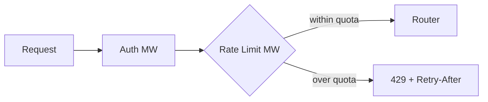

## Context

The API is a stateless service scaled horizontally across multiple instances. Rate limiting must balance "good enough per instance" against "consistent across instances". This change targets shipping a usable limit, not cross-instance precision.

## Goals / Non-Goals

**Goals:**

- Users exceeding `60 req/min` are blocked with `429` + `Retry-After`.
- Limiting logic is testable, configurable, and safe by default.
- Health-check and internal endpoints are never limited.

**Non-Goals:**

- Cross-instance exact counting (out of scope this iteration; see Risks).
- Distributed quota sync / Redis backend (later iteration).

## Decisions

- **Algorithm**: token bucket — tolerates bursts better than a fixed window.
- **Backend**: in-memory per instance first (a known, acceptable approximation), behind a `RateLimitStore` interface so a later swap to Redis leaves the middleware untouched.
- **Placement**: after the auth middleware (it needs the user id) and before routing; health-check paths bypass the limiter.

## Risks / Trade-offs

- **Cross-instance imprecision**: with in-memory state the effective ceiling is approximately `quota × instance count`. Known and acceptable; it converges once moved to Redis.
- **Middleware ordering**: wrong placement can wrongly block health checks — the task list includes a verification task for this boundary.
